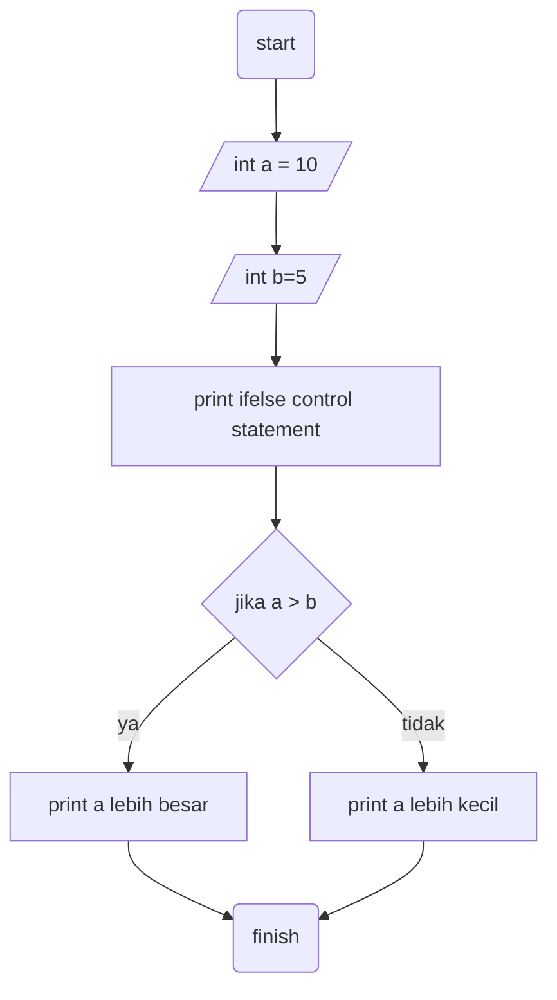

```mermaid
    flowchart TD;
    A(start) -->  B[/int a = 10/];
    B --> C[/int b=5/];
    C --> D[print ifelse control statement];
    D --> E{jika a > b};
    E --ya--> F[print a lebih besar];
    E --tidak--> G[print a lebih kecil];
    F --> H(finish);
    G --> H;
```